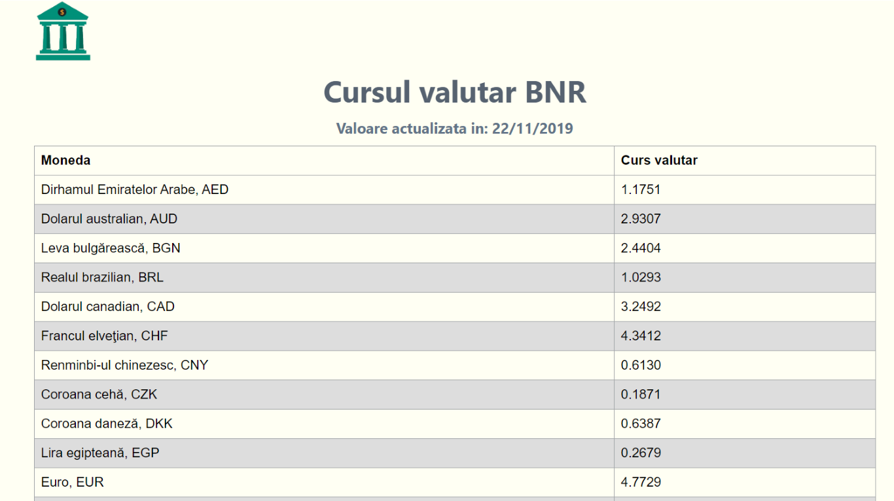

# BNR Currency Rates

Currency rates app from the BNR official site.
Screenshot:

## Getting Started

1. In order to use this app you need to have installed PHP, MySQL and a webserver (example: Apache / Nginex).

2. Run the SQL dump from db/bnr_currecy.sql to create the database.

3. Run update_db.php to update the database (this is best to be ran with a cron job every day in ordet ot keep the database updated)

4. Vizist index.php to see the rates

## Authors

- **Mihaela Constantin** - _Creation and maintenace_ - [MihaelaConstantin](https://github.com/MihaelaConstantin)
